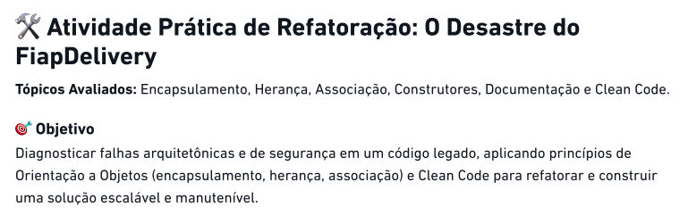
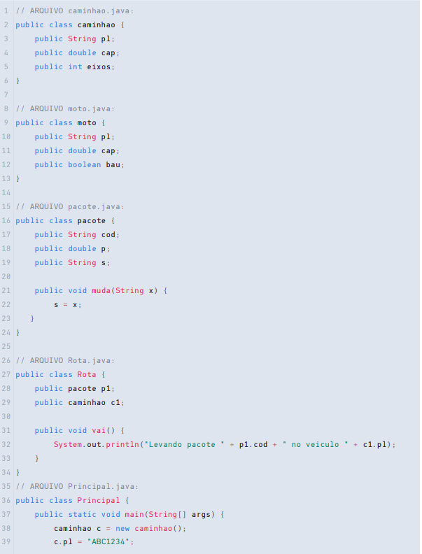
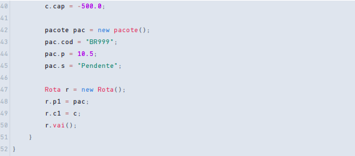
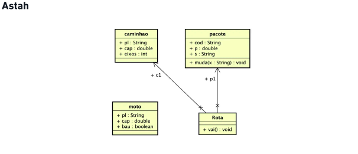
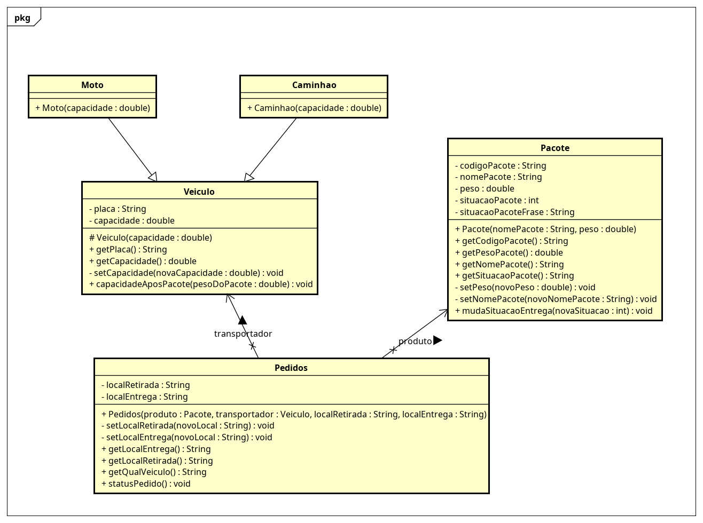
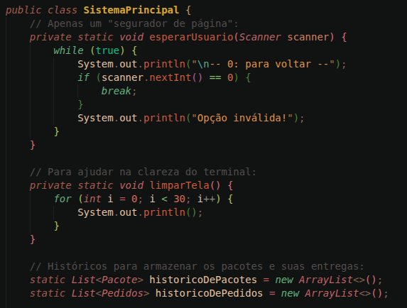
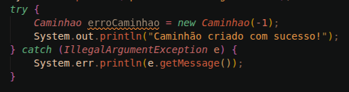
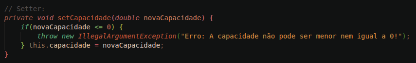

---
# Fiap CheckPoint de POO

### Índice dos tópicos:

1. [Sobre o projeto](#sobre-o-projeto)

2. [Explicações sobre o código](#explicações-sobre-o-código)

3. [Explicações sobre as Classes](#explicações-sobre-as-classes) 

---

# Sobre o projeto:

Esse repositório diz respeito ao CheckPoint 02 de Programação Orientada a Objeto, matéria no segundo ano de Ciência da Computação da FIAP.
A ideia do CheckPoint é refatorar completamente o código de um "estagiário".

Proposta dada pelo professor:

.

Código do "estagiário":

Precisamos também refazer o Astah planejado pelo estagiário.
Astah do estagiário:

Meu Astah:

---
# Explicações sobre o código:
Este tópico mostra explicações sobre o que fiz e como usar o código.

### Usabilidade:
Fiz um sistema onde é possível simular compras de um mercado virtual, e o sistema por trás de levar essas compras para seu respectivo destino.

Já ao executar o código você se depara com 4 opções:
0 - Para desligar o programa.
1 - Um teste de erros, que exibe propositalmente os Excepts feitos para validações na criação de Objetos.
2 - O mercado virtual em si, onde o usuário pode fazer suas compras.
3 - O local onde o usuário pode ver sobre seus pedidos, que veículo está encarregado de levar, peso, e qualquer outro status sobre.

### Explicações mais técnicas:
Antes de iniciar o programa em si, preparei algumas funções e históricos:
Sobre os históricos, são listas de arrays, para guardar os objetos que são comprados, e o pedido em si.

Inicialização dos Objetos:
Sempre é importante inicializar objetos com try e catch, e nas Classes ter empecilhos que, além de não montarem o Objeto quando há algo de errado, também mandam uma mensagem de erro.

Imagem do Try e Catch:

Imagem da mensagem de erro na classe:

---
# Explicações sobre as Classes
Explicações sobre o motivo das classes do meu sistema ser do jeito que são, e o que elas fazem.

## Minhas Classes

### Caminhao e Moto:

No código do estagiário, o que diferenciava realmente essas classes uma da outra é que o caminhão possuía eixos e a moto baú. Mas como ambos só interferem na capacidade desses veículos, não achei que fazia sentido mante-los, então os removi e criei uma nova regra de negócio: passou de 40 Kg, passa pro caminhão, se não passar o pacote vai na moto.

### Veiculo:

A Classe mãe do Caminhao e Moto explicados anteriormente, é daqui que eles herdam basicamente tudo, aqui que a classe é construída e etc.

O construtor da Classe está como Protected, eu fiz isso primeiramente porque o Eclipse deu a sujestão, mas após pesquisar sobre entendi que é o melhor jeito de deixar a visibilidade deste construtor, já que, resumindo um pouco, serve para que as Classes do caminhão e moto possam acessar e usar o construtor, já o sistema principal não. Como a ideia é nunca construir um veículo sem especificar antes o que ele é, é perfeito.

### Pacote:

A Classe dos objetos comprados, e disponíveis para comprar.

### Pedidos:

A Classe que vai juntar os veículos com os pacotes, fazer toda a logística de onde foi a retirada, onde será a entrega, a situação do pedido e principalmente, guarda todos esses dados.

Nessa classe que está montado o método que vai mostrar todos os dados dos pedidos ao usuário.

---
